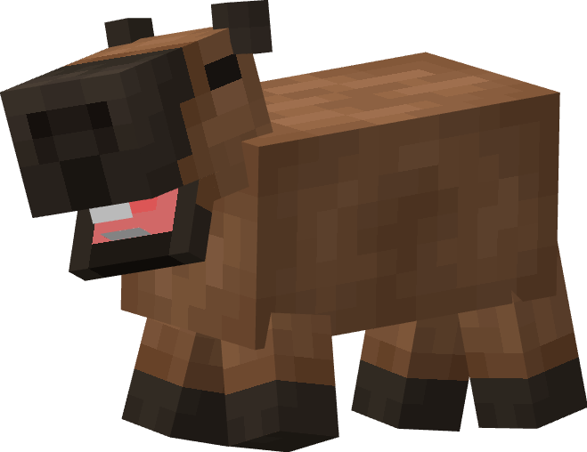
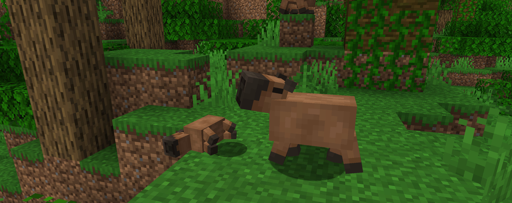
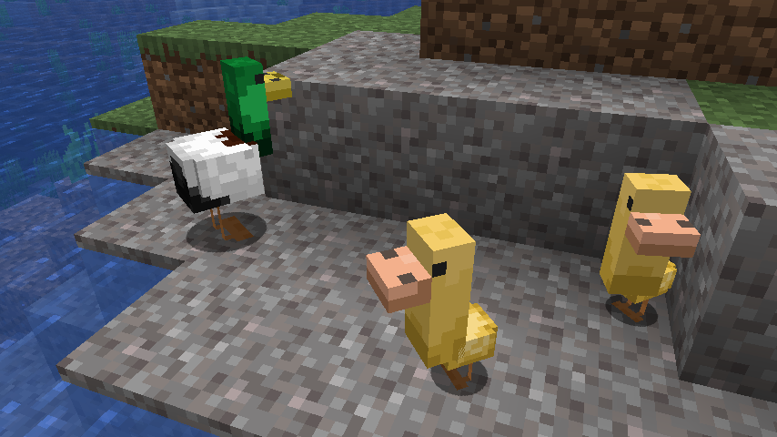

# 🦆 Animals


You can change the natural spawning frequency of any animal in the mod's configuration.


## Capybaras

<figure><figcaption>
Official render of the Capybara
</figcaption></figure>

 

<figure><figcaption>
In-game screenshot of a baby capybara sleeping and an adult Capybara walking
</figcaption></figure>

The biggest (and cutest!) **rodent** of the planet is in **Promenade**.

This rather smelly animal will spawn in **swamps** and **rivers**. You may also encounter babies, which have their own set of cute sounds. They currently eat **carrots** and **melon slices**.

Talking of sounds, capybaras will be the very first mob of the game (and the mob) to be able to... **fart**... You've read that right...

Occasionally, they will let their fat body fall on the side and start **sleeping**. If they fall asleep during night, they will only wake up at **dawn**.

#### Details

There are 2 variants of the capybara:

* **Brown** (`promenade:brown`)
* **Albino** (`promenade:albino`)

These variants are stored in the capybara's NBT tag (for example: `{Variant: "promenade:brown"}`)

## Ducks

<figure><figcaption>
In-game screenshot of two ducklings and a mallard duck
</figcaption></figure>

The ducks are webbed birds that fall slower than other animals, but swim better than most of them. They like to eat seeds. It will drop feathers and duck food upon dying. 🦆

#### Details

A duck will have the appearance of a duckling when it is a child.

There are 2 variants of the duck:

* **Pekin** (`pekin`): Spawns in plains and forests.
* **Mallard** (`mallard`): Spawns in plains, rivers and swamps.

These variants are stored in the duck's NBT tag (for example: `{Type: "mallard"}`)

