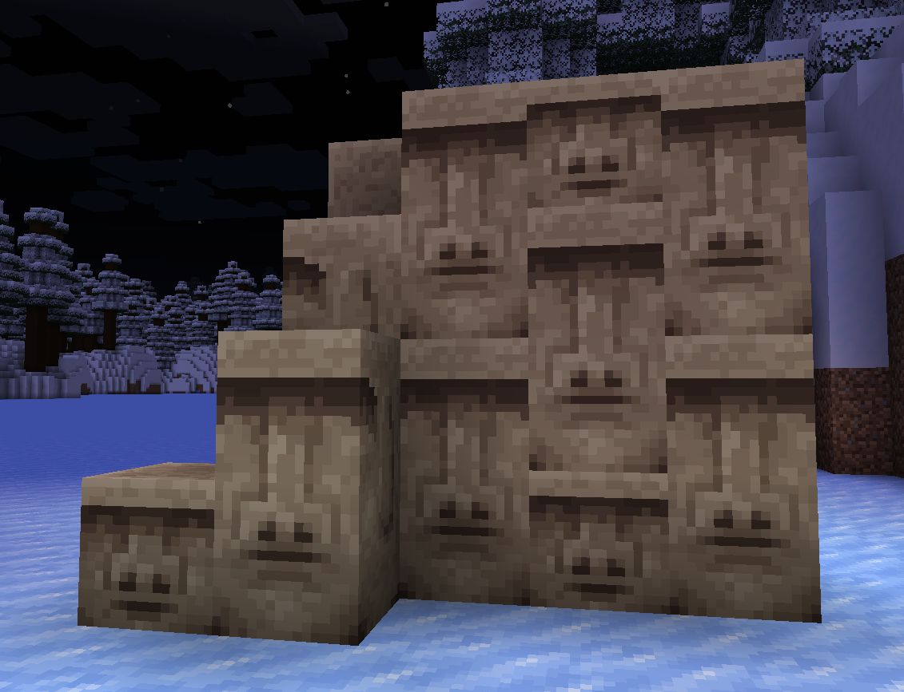

# 🧱 Blocks

## Wood/Hyphae

### Sakura

<figure><figcaption></figcaption></figure>

This japanese-styled wood can be collected from [**sakura trees**](world-generation/biomes.md#sakura-groves). 🌸

### Maple

<figure><figcaption></figcaption></figure>

This soothing wood can be collected from [**maple trees**](world-generation/biomes.md#carnelian-treeway). 🍁

### Palms

<figure><figcaption></figcaption></figure>

This orange wood can be collected from [**palm trees**](world-generation/other.md#palm-trees). 🌴

### Dark Amaranth

<figure><figcaption></figcaption></figure>

This purple venous hyphae can be collected from [**huge dark amaranth fungi**](world-generation/biomes.md#dark-amaranth-forest). 🕸️

## Vegetation

### Piles

Flower and Leaf Piles are small carpet-like blocks that can be found in some biomes or can be crafted with 3 flowers or 3 leaves blocks. 🍃

## Other

### Moai

Inspired by the [moai statues](https://en.wikipedia.org/wiki/Moai), the moai block obtained through cutting a tuff block with a stonecutter. 🗿

The moai can be oriented horizontally and can be made taller by stacking one above or below another.

<figure><figcaption>
🗿🗿🗿
</figcaption></figure>
