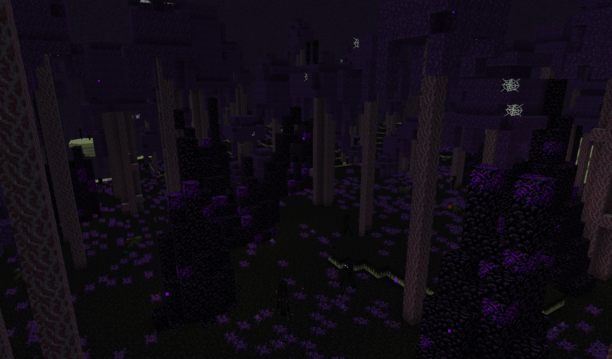

# Biomes


**Due to a missing Fabric API module, Promenade v2.5.0 and higher versions require** [**TerraBlender**](https://www.curseforge.com/minecraft/mc-mods/terrablender-fabric) **to be installed for overworld biomes to appear in your world.**



You can change the natural spawning frequency of any biome in the mod's configuration.


## Sakura Groves

Inspired by the beautiful and worldwide-known sakura trees (or cherry blossoms), this flourishing pink and white biome is a peaceful home to the new [**sakura wood type**](../blocks.md#cherry-oak) and japanese-inspired natural decoration. 🌸

These biomes also feature a brand new soundtrack: ["**Brise couleur pastel**" by **LudoCrypt**](../soundtrack.md#brise-couleur-pastel).

<figure><figcaption>
In-game screenshot of a pink cherry oak forest
</figcaption></figure>

#### Details

There are 2 variants of this biome:

* **Blush Sakura Grove** (`promenade:blush_sakura_grove`)
  * Has more pink trees than white trees.
  * Has patches of pink blossom piles.
* **Cotton Sakura Grove** (`promenade:cotton_sakura_grove`)
  * Has more white trees than pink trees.
  * Has patches of white blossom piles.

They both generate in the Overworld as frequently as normal forests, but this frequency can be changed in the mod's configuration.

## Carnelian Treeway

<figure><figcaption>
In-game screenshot of a carnelian treeway
</figcaption></figure>

This colorful forest is inspired by the greatest maple forests in the autumn season. Bees prefer living their life here for the coziness of the trees and the calm environment. When you strip a natural maple log, you have a 10% chance to find **syrup** drooling on its side. You can also transform maple logs into [**maple wood blocks**](../blocks.md#maple). 🍁

#### Details

There is only 1 variant of this biome:

* **Carnelian Treeway** (`promenade:carnelian_treeway`)

It generates in the Overworld as frequently as normal forests, but this frequency can be changed in the mod's configuration.

## Glacarian Taiga

<figure><figcaption>
In-game screenshot of a glacarian taiga
</figcaption></figure>

Welcome the snowiest and coldest biome of Minecraft! \
The glacarian taiga features massive snowy spruce trees and layers upon layers of snow. You can also find patches of packed ice underground, or slide on some as they cover the surface of lakes and rivers. ❄


WARNING TO ALL TRAVELERS:

It has been found out that snowstorms in this biome can get extreme very quickly. Proceed with caution and take shelter the moment you see some snow falling.


#### Details

There is only 1 variant of this biome:

* **Glacarian Taiga** (`promenade:glacarian_taiga`)

It generates in the Overworld and tries to replace a lot of vanilla snowy biomes, but this frequency can be changed in the mod's configuration.

## Dark Amaranth Forests

<figure><figcaption>
In-game screenshot of a dark amaranth forest
</figcaption></figure>

The Dark Amaranth Forest gives a spookier aspect on some parts of your end-game exploration. Filled with **tall amaranth fungi**, this forest is home to spiders and cave spiders. The [**dark amaranth hyphae type**](../blocks.md#dark-amaranth) gives a unique dark purple color palette to use in your builds. 🕸️

#### Details

There are 2 variants of the biome:

* **Dark Amaranth Forest** (`promenade:dark_amaranth_forest`)
* **Tall Dark Amaranth Forest** (`promenade:tall_dark_amaranth_forest`)

They both generate in the Ender. Their frequency can be changed in the mod's configuration.
