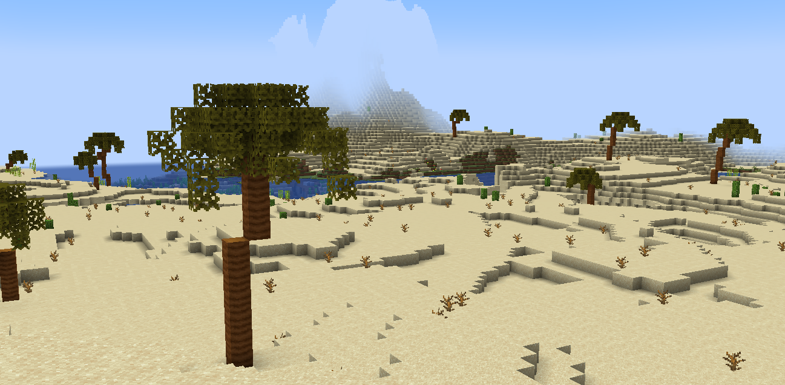

# Other

## Blunite and Carbonite

The blunite and carbonite blocks are two new igneous rocks of blue and black colors respectively. They generate as frequently as other igneous rocks (andesite, granite, diorite...). 🪨

They can be crafted or cut into slabs, stairs, walls or into polished blocks, slabs and stairs.

## Palm Trees

<figure><figcaption></figcaption></figure>

Palm trees generate in biomes with desert vegetation. Their leaves can drop **bananas** and their trunk can be crafted into [**palm wood blocks**](../blocks.md#palm). 🌴

## Blueberry Bushes

Blueberry bushes generate in the biomes where sweet berry bushes can be found. 🫐
